# UCC Revorked

A Fluent-style Linux control center for Uniwill laptops, rebuilt around a native
**Qt 6 / C++20 interface**. Manage performance profiles, cooling, keyboard lighting
and hardware settings, with live CPU/GPU monitoring and **Light, Dark and Auto** themes.

This is a fork of [nanomatters/ucc](https://github.com/nanomatters/ucc), with
hardware integration for **MECHREVO YAOSHI Series-X6AR55xY**. The redesign keeps the
existing daemon and D-Bus architecture: the desktop application runs as your user,
while `uccd` performs hardware operations through the kernel driver and Bluetooth.

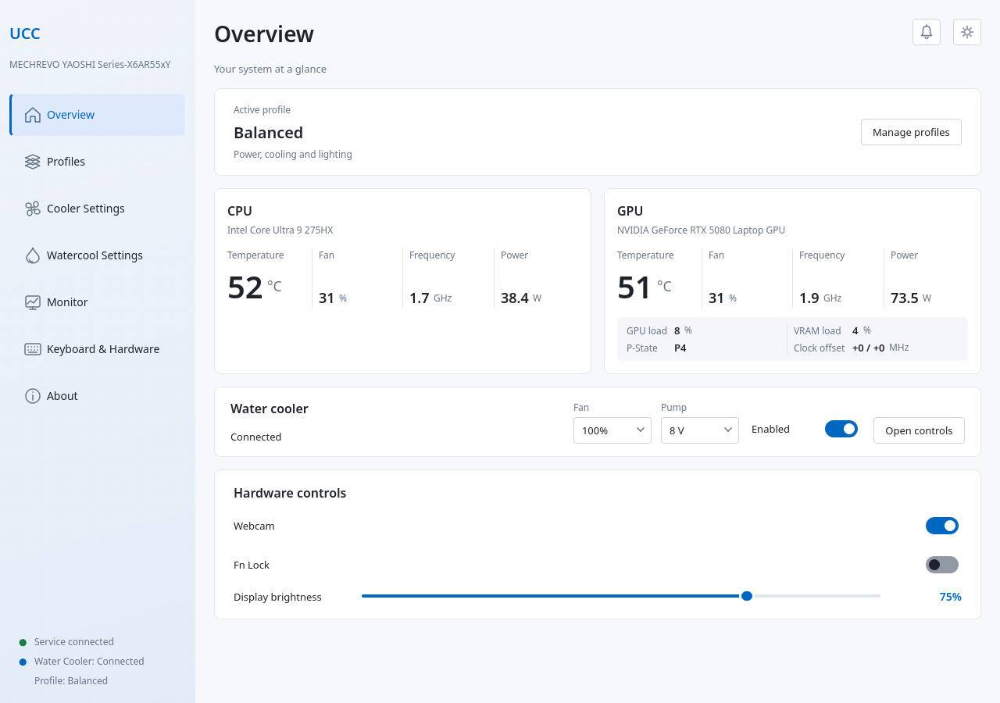

## Interface and features

| Section | Functionality |
| --- | --- |
| **Overview** | CPU and GPU identification, temperature, fan duty, frequency and power. GPU load, VRAM load, P-state and clock offsets are grouped as secondary details. Connected water-cooler controls include immediate Fan/Pump presets and an enable toggle. |
| **Profiles** | A compact profile dropdown with Apply, Save, Copy and Remove actions. Configure CPU cores, governor and EPP, frequency settings, supported power limits, charging, display settings, fan and keyboard profile assignments. Assign profiles to AC, battery and water-cooler states. |
| **Cooler Settings** | Separate CPU/GPU fan curves, shared-speed behavior where supported, fan-profile selection, application, copying, saving and removal. |
| **About** | Build version/commit, Qt runtime, upstream credits, open-source components and bundled license/attribution texts. |
| **Watercool Settings** | Cooler enable toggle, manual fan speed, pump voltage, LED color/effects, water-cooler fan curve and pump-voltage curve. Accessible directly from the sidebar. |
| **Monitor** | Temperature, fan duty, power, clocks and core-voltage history. Select metrics, use separate or unified graphs, pause, zoom and inspect points with crosshair/sticky markers. Smooth chart presentation is independent of telemetry polling; the power axis tops out at 250 W. |
| **Keyboard & Hardware** | Keyboard lighting profiles, per-key selection/color, multi-key selection, global color and brightness. Hardware controls include webcam, Fn Lock and display brightness when the device exposes them. |

Availability follows the hardware capabilities reported by the daemon. The exact
Mechrevo DMI match enables the known controller features; generic SKU `0001` is not
whitelisted for unrelated laptops. Other upstream Uniwill devices have not been
retested with every change in this fork.

### Shared UI behavior

- **Light / Dark / Auto:** the top-right sun/moon button cycles the appearance.
  Auto follows the color scheme reported by Qt. The selected appearance is saved
  in ordinary builds; preview builds keep it in memory.
- **Consistent components:** shared semantic colors for cards, selectors, buttons,
  toggles, charts, keyboard keys, menus and color dialogs.
- **Sidebar status:** service, cooler and active profile use the same typography
  and alignment. Colored dots carry state information.
- **Notifications:** the bell next to the theme button shows an unread indicator.
  Its panel keeps the latest 200 events for the current GUI session, with section,
  message and local date/time. Read individual entries, mark all as read or clear
  the history. Operation messages appear here instead of crowding the sidebar.
- **Transitions:** short page/card entrances use the active theme background.
  Set `UCC_REDUCED_MOTION=1` to turn off those entrances.
- **Compact layout:** aligned primary metrics, subdued metadata, dropdown profile
  selection and direct navigation to each cooling section.
- **Backdrop:** translucent sidebar with a blur request on supported X11
  compositors. Actual blur depends on compositor support; transparency remains
  available when the compositor does not implement that protocol.
- **Single instance:** opening UCC again activates the existing window.

### Fan, Pump and Auto

The Overview Fan presets are **Auto, 20%, 40%, 60%, 70%, 80%, 90%, 100%**.
Pump presets are **Off, 7 V, 8 V and 11 V**.

Selecting a manual preset sends the command immediately. After a successful write,
UCC disables the water cooler's shared automatic Fan/Pump mode so the temperature
curve cannot immediately overwrite the selected value. A failed write preserves
the previous mode. Selecting **Auto** returns both to their configured curves on
the next controller cycle. **Save** on a custom system profile persists the manual
Fan/Pump values along with the automatic/manual mode. Applying that profile or
restarting the daemon restores the saved values when the cooler connects; a
reconnection restores them again. Selecting a preset alone changes the running
state, so save the profile to retain it across daemon restarts. Older profiles
without manual values remain compatible.

### Permissions and desktop integration

Routine control, including applying/saving system profiles, cooling curves and
keyboard profiles, is allowed through Polkit for the **active local session**
without repeated password dialogs. The GUI does not need `sudo`. Installing files
and administering the system service still requires administrator rights. Explicit
charge-threshold/type administration retains the separate administrative action.

Optional integrations:

- **GNOME Shell extension:** panel controls and telemetry using asynchronous Gio
  D-Bus calls. Closed menus do not keep polling; slider commands use bounded queues.
- **KDE Plasma applet:** retained upstream integration, built separately with
  `BUILD_TRAY=ON` and the required Plasma/KDE development packages.
- **CLI:** `ucc-cli` provides command-line access to the daemon; use
  `ucc-cli --help` for the available commands.

## Screenshots

These are captures of the actual Qt application, using deterministic test telemetry
and sample profiles. They are not generated mockups and their numerical values are
illustrative. Click an image to see its full size.

| Screen | Light | Dark |
| --- | --- | --- |
| Overview |  | 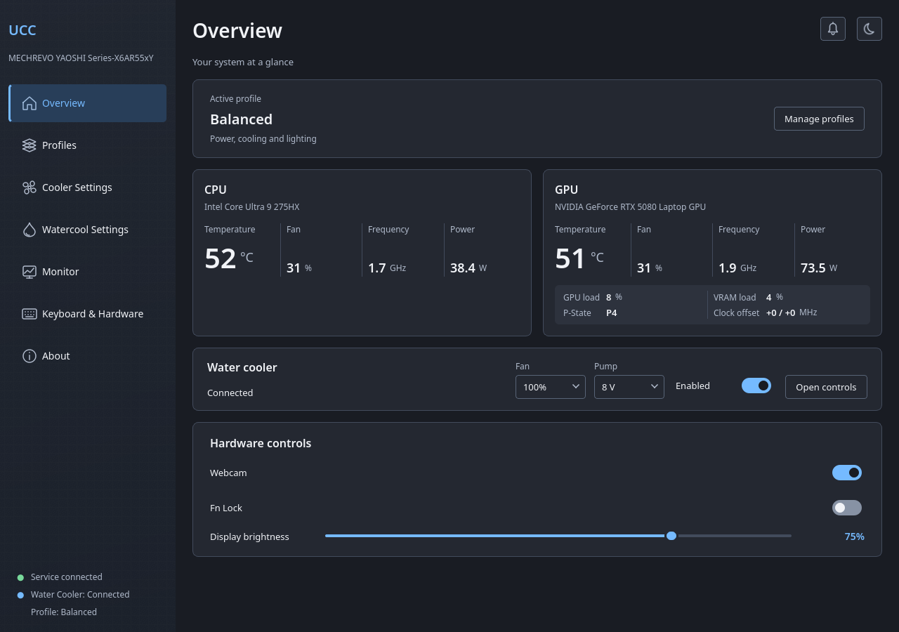 |
| Profiles | 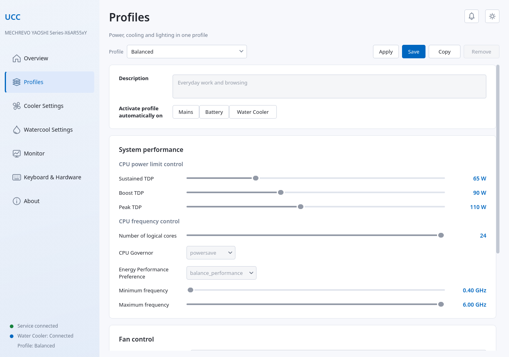 | 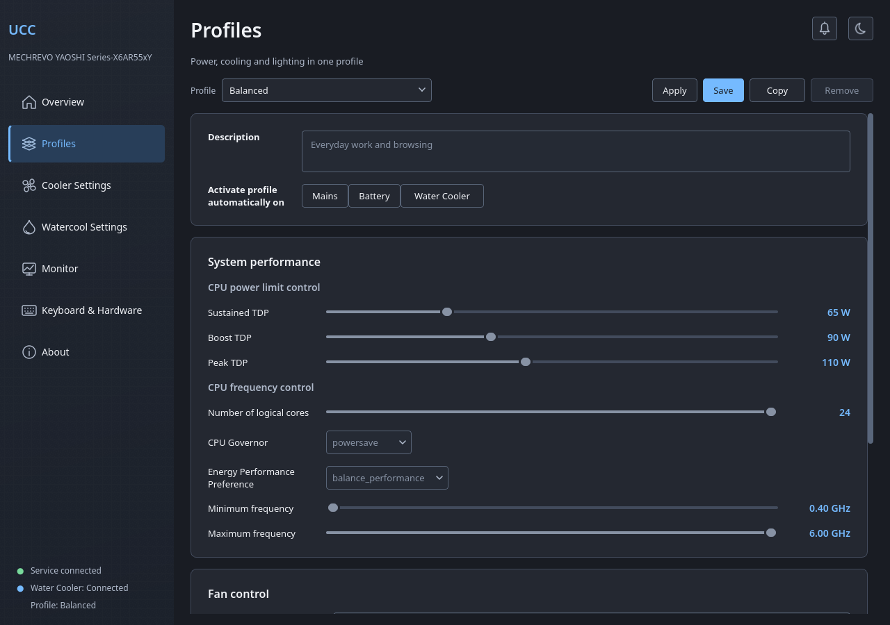 |
| Cooler Settings | 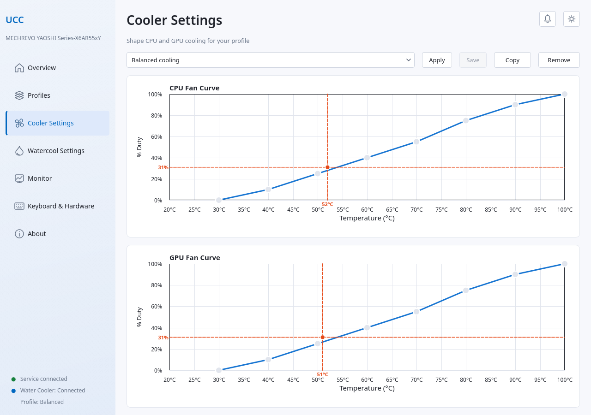 | 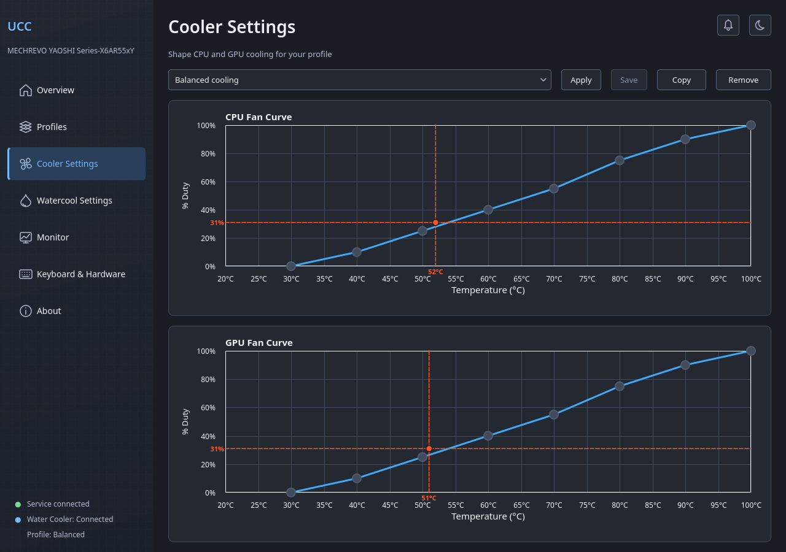 |
| Watercool Settings | 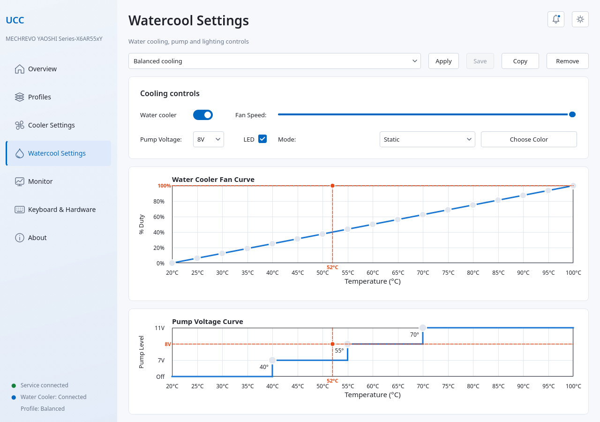 | 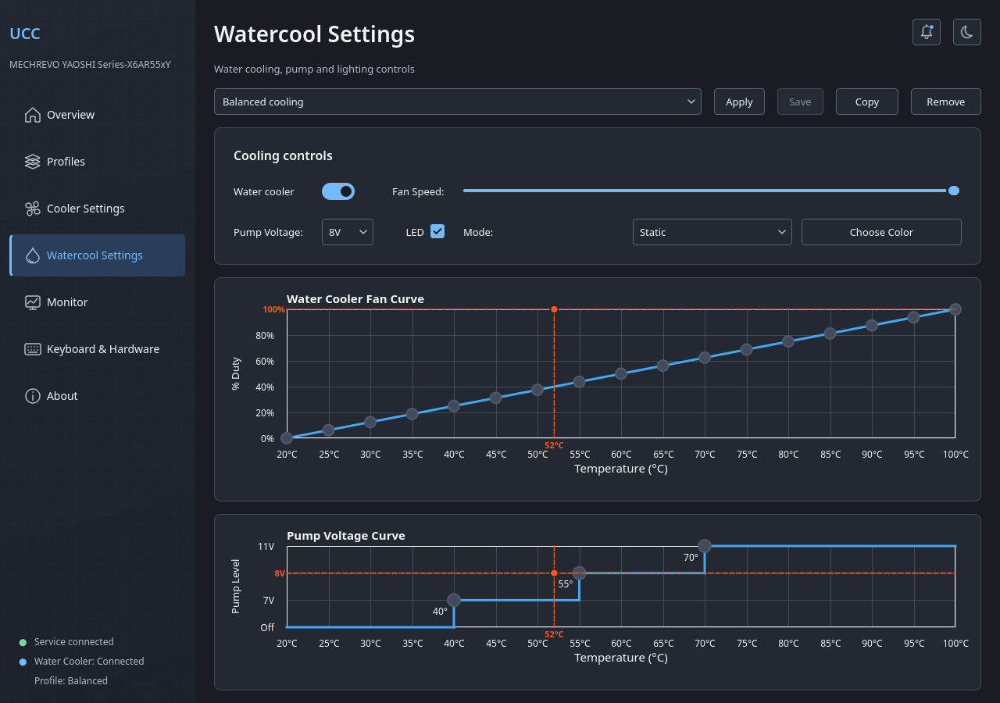 |
| Monitor | 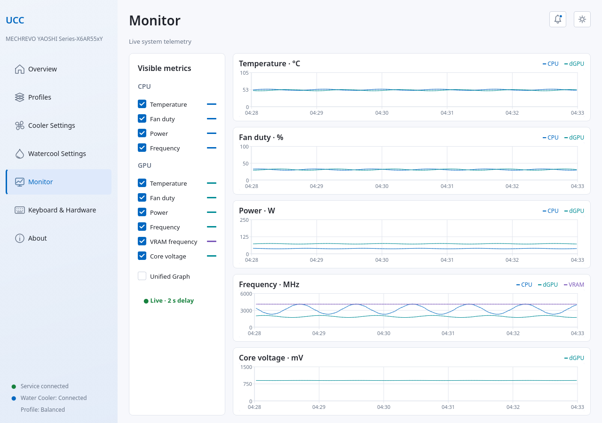 | 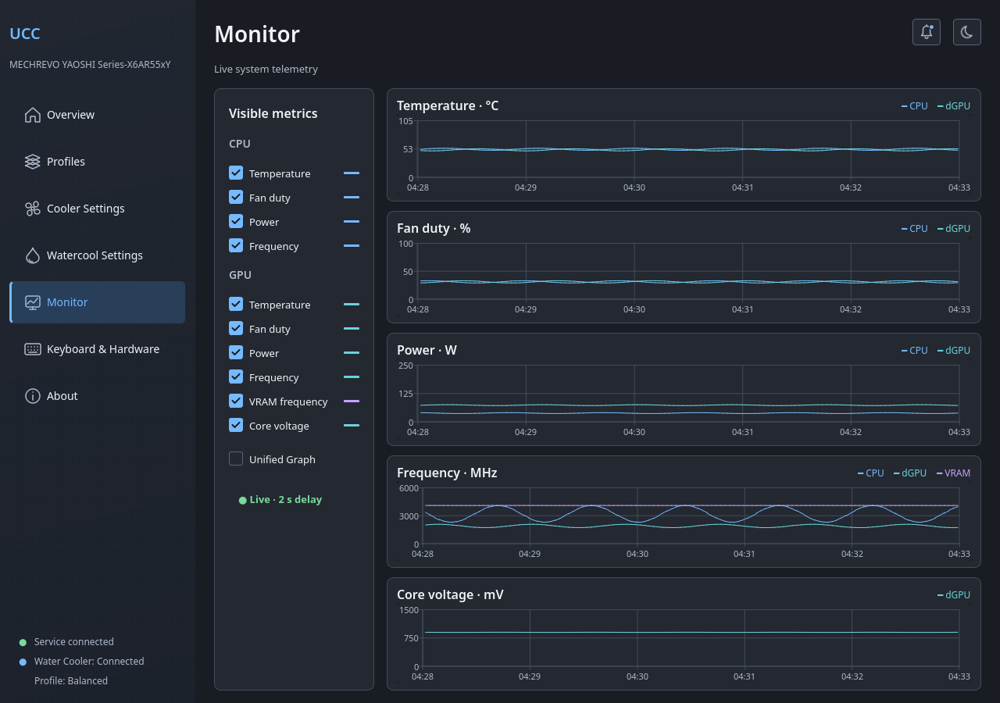 |
| Keyboard & Hardware | 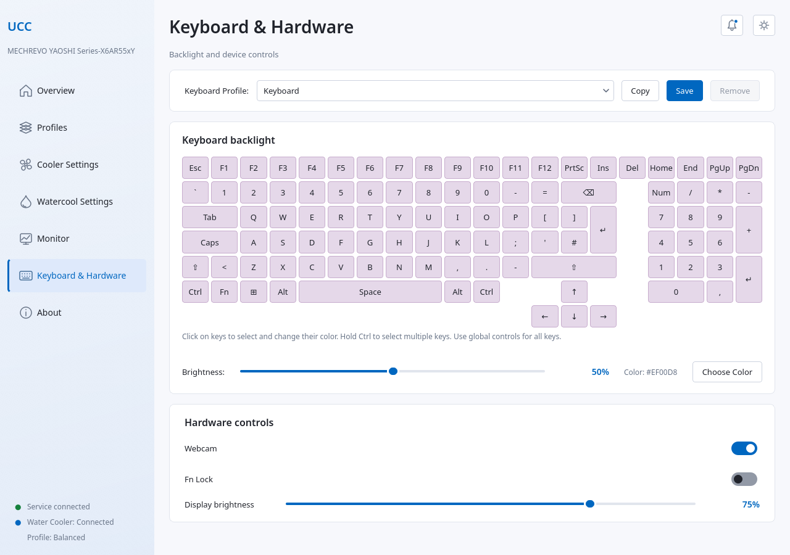 | 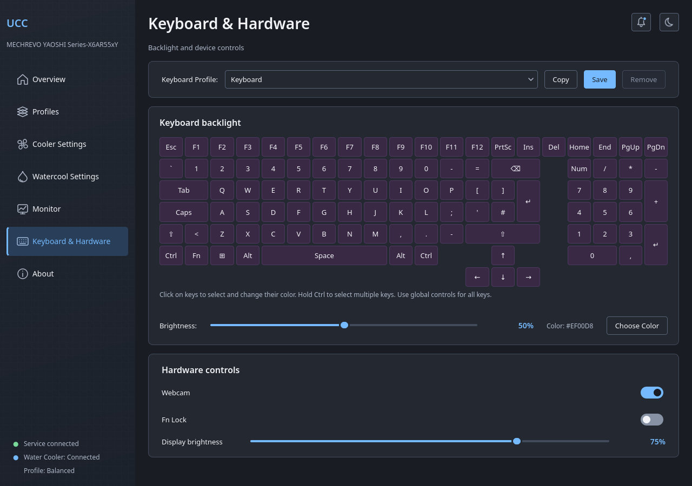 |
| About | 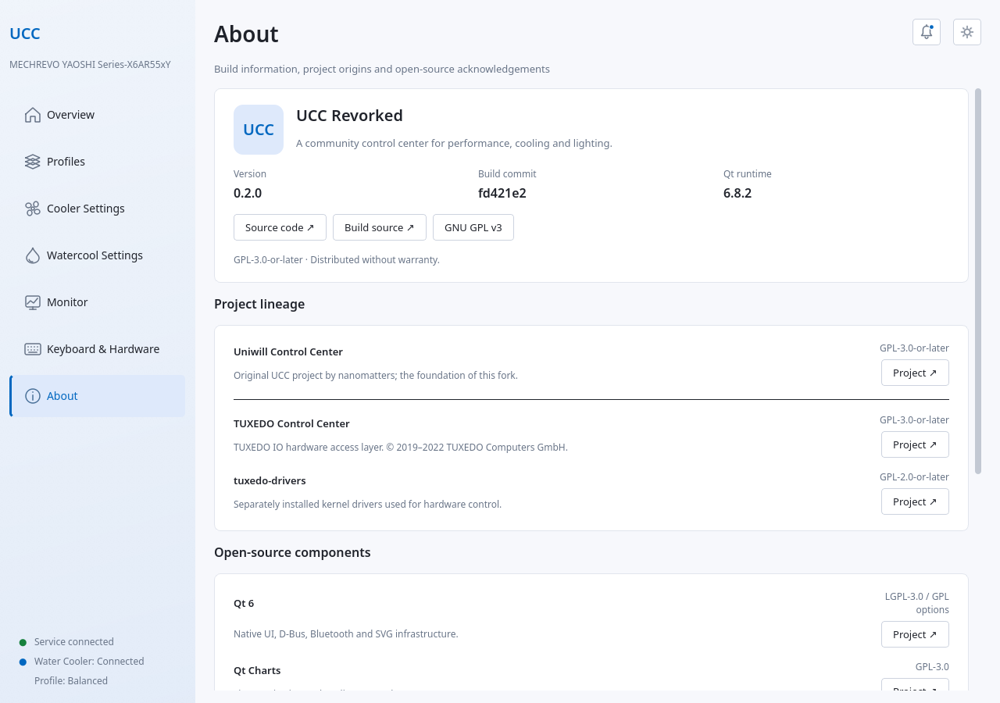 | 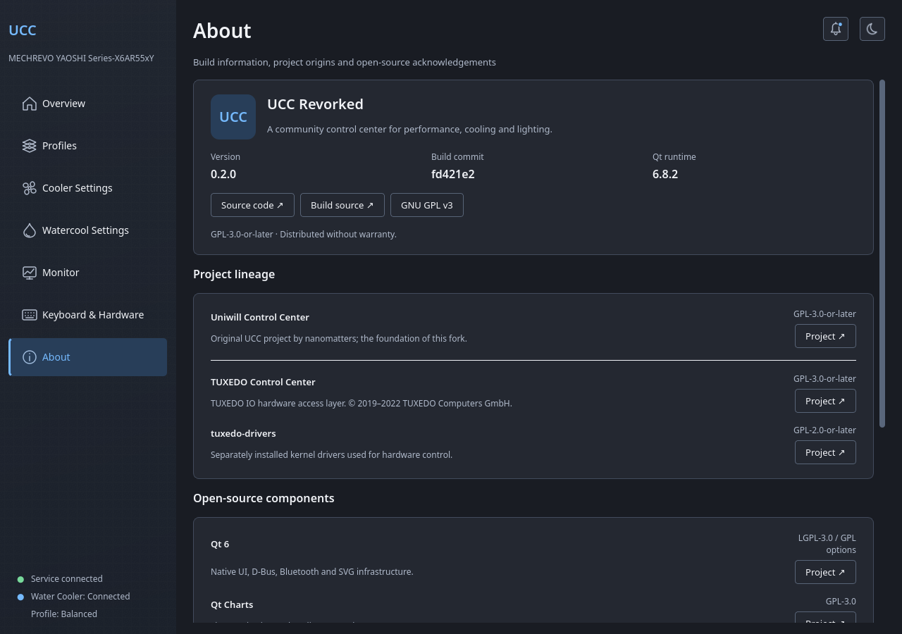 |
| Notifications | 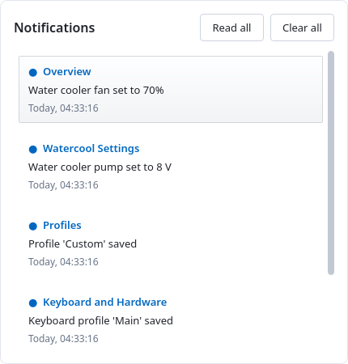 | 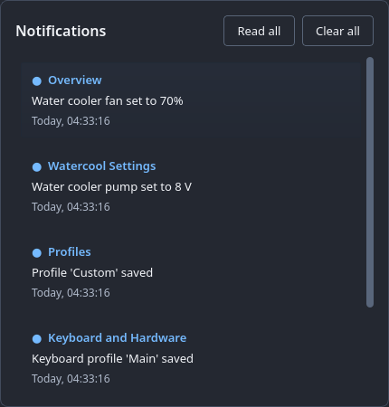 |

The approved [design references](docs/design/references/fluent-ui/) and detailed
[visual verification](docs/design/verification/) are also stored in the repository.

## Architecture

| Component | Role |
| --- | --- |
| `uccd` | System daemon: hardware access, profiles, metrics history, Bluetooth cooler connection and control. |
| `libucc-dbus` | Shared Qt D-Bus client library. |
| `ucc-gui` | Qt Widgets/Charts desktop application. Plasma is not required. |
| `ucc-cli` | Command-line client. |
| `ucc-gnome` | GNOME Shell extension. |
| `ucc-tray` | Optional KDE Plasma applet. |

Main GUI telemetry is polled asynchronously every two seconds. Presentation frames
interpolate the chart movement independently. Polling/animation is paused when
appropriate for hidden or minimized views. Bluetooth reconnection uses increasing
retry delays and recovers when an adapter becomes available after daemon startup.
Loading a view or refreshing telemetry does not issue implicit pump-off/fan-zero
commands.

## Build from source

### Requirements

- Linux, CMake **3.20+**, Ninja or Make, Git and a **C++20** compiler.
- Qt 6 development packages: Core, DBus, Gui, Widgets, QML, Quick,
  QuickControls2, Bluetooth and Charts. The current interface is validated with
  **Qt 6.8.2**. Qt Test is needed when `BUILD_TESTS=ON`.
- `libudev` development files; `pkg-config` and optional XCB development files
  for the X11 backdrop integration.
- For hardware control: systemd, D-Bus, Polkit, BlueZ and a compatible
  `tuxedo-drivers` kernel module. Building UCC does not install that module.
- For tests: Python 3, a C++ compiler and `dbus-run-session`. GJS and Node.js
  enable the additional GNOME tests.
- For the Plasma applet only: ECM, KDE Frameworks 6 Config/CoreAddons and Plasma
  development files.

On Debian 13, the GUI/CLI build dependencies can be installed with:

```bash
sudo apt install \
  build-essential cmake ninja-build git pkg-config \
  qt6-base-dev qt6-declarative-dev qt6-connectivity-dev qt6-charts-dev \
  qt6-svg-dev libudev-dev libxcb1-dev \
  dbus bluez polkitd python3 gjs nodejs
```

For native Wayland sessions, also install `qt6-wayland`. Runtime Qt SVG support is
used for the themed controls. Driver installation is device/distribution specific;
see the [Mechrevo integration guide](contrib/mechrevo/README.md).

### Configure, build and test

```bash
git clone https://github.com/noteMASTER11/UCC-Revorked.git
cd UCC-Revorked

cmake -S . -B build -G Ninja \
  -DCMAKE_BUILD_TYPE=Release \
  -DCMAKE_INSTALL_PREFIX=/usr \
  -DCMAKE_INSTALL_LIBDIR=lib \
  -DBUILD_GUI=ON -DBUILD_CLI=ON \
  -DBUILD_TRAY=OFF -DBUILD_GNOME=ON \
  -DBUILD_TESTS=ON -DUCC_READ_ONLY_PREVIEW=OFF

cmake --build build -j2
ctest --test-dir build --output-on-failure
```

`-j2` is a modest default; increase it to suit the machine. The resulting binaries
are in `build/bin/` and the client library is in `build/lib/`.

| CMake option | Default | Purpose |
| --- | --- | --- |
| `BUILD_GUI` | `ON` | Desktop GUI. |
| `BUILD_CLI` | `ON` | Command-line client. |
| `BUILD_TRAY` | `ON` | Plasma applet; set **OFF** for a Qt-only/GNOME build. |
| `BUILD_GNOME` | `ON` | Install GNOME extension files. |
| `BUILD_TESTS` | `OFF` | Qt, Python and available GNOME tests. |
| `UCC_READ_ONLY_PREVIEW` | `OFF` | Build clients that block hardware/settings writes. |

### Install and launch

The configured `/usr` prefix and `lib` directory match the supplied systemd service
paths. Stop an existing `tccd.service` before running `uccd`; use a compatible
kernel driver for your laptop.

```bash
sudo cmake --install build
sudo ldconfig
sudo install -d -m 0755 /etc/ucc
sudo systemctl daemon-reload
sudo systemctl reload dbus
sudo systemctl enable --now uccd.service

# Start the GUI as your normal desktop user:
ucc-gui
```

Review `uccd-pre-sleep.service` and `uccd-sleep.service` for your desktop's suspend
integration. The Mechrevo distribution recipe has its own suspend-unit override;
a generic CMake installation is not identical to that package.

For diagnostics:

```bash
systemctl status uccd.service
journalctl -u uccd.service -b
ucc-cli --help
```

### Read-only UI preview

Use a separate build directory for prototyping:

```bash
./run-preview.sh
```

This configures `build-preview/`, builds the GUI, and starts it. The preview can read
current daemon data but blocks hardware commands and profile/settings writes.
Appearance changes remain in memory. It uses a separately named preview client
library to avoid resolving the installed write-enabled library.

For a manual preview build, use `-DUCC_READ_ONLY_PREVIEW=ON` and keep it separate
from the normal installation. Do not install a preview as the controlling package.

## Mechrevo drivers, packaging and migration

See [contrib/mechrevo/README.md](contrib/mechrevo/README.md) for the Arch/CachyOS
recipes, pinned TUXEDO driver patches, exact-DMI matching, ITE RGB integration,
NVIDIA diagnostic behavior, migration of TCC profiles/keyboard/cooler identity,
and service/rollback notes.

UCC does not automatically upgrade the kernel driver. The companion patch set
keeps NVIDIA EC power writes disabled by default; installing this fork does not
make an unavailable cTGP interface writable.

Upstream RPM/DEB/Arch targets and the Nix flake are retained, but those packaging
paths have not been validated for the complete Mechrevo configuration. For NixOS,
use `ucc.url = "github:noteMASTER11/UCC-Revorked"`, import
`ucc.nixosModules.default` and enable `services.uccd.enable`; see [nix/](nix/).

## Verification and current constraints

The current local test suite passes **18/18 tests**. It includes device matching,
Bluetooth selection/startup/retries, profile handling, async D-Bus behavior,
monitoring/history, preview write guards, theme/animation behavior, GUI singleton,
authorization classification, manual cooler profile round-trips/reconnection,
successful/failed manual overrides and notification read/clear behavior.
Private D-Bus sessions and fake hardware keep these tests separate from the live
controller. Screenshots cover all six pages in both themes and smaller windows.

Validation is concentrated on the Mechrevo machine described above and the local
Qt 6.8.2 setup. Compositor blur, automatic appearance reporting, display features
and optional Plasma integration depend on the desktop/platform. Some initial
loads and explicit commands remain synchronous; BLE command spacing still includes
a short wait in the daemon. Wider suspend/resume and cross-device testing remains
useful before treating every upstream hardware feature as verified.

## Credits and license

Based on [nanomatters/ucc](https://github.com/nanomatters/ucc), starting from
[`d2987af`](https://github.com/nanomatters/ucc/commit/d2987af6cbaa39a7357dc610d107da269d42b3a0),
with TUXEDO IO code from [TUXEDO Control Center](https://github.com/tuxedocomputers/tuxedo-control-center),
[tuxedo-drivers](https://github.com/tuxedocomputers/tuxedo-drivers) hardware integration and research from
[Mechrevo-Yaoshi-Linux](https://github.com/noteMASTER11/Mechrevo-Yaoshi-Linux).

**GPL-3.0-or-later.** Separate driver sources and patches retain their upstream
licensing. The project is a community fork; the Fluent-style redesign is not
an official Microsoft product.

The complete GPL v3 text is in [COPYING](COPYING). See [third-party acknowledgements](THIRD_PARTY.md) for component roles, licenses and retained notices. These documents are also available offline from **About**.
